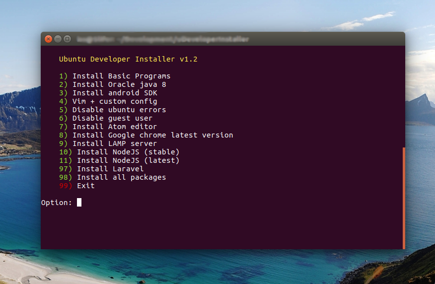

#uDeveloperInstaller v1.2



Auto install ubuntu development tools

- Apache+mysql+phpmyadmin
- Android SDK+Cordova+Ionic
- Disable guest session Ubuntu
- Disable error aport Ubuntu
- Install Nodejs and dependences
- Basic Media programs
- Install Oracle Java

##Notes:
Please run script as ROOT!

```sh
sudo chmod +x ubuntu.sh
sudo ./ubuntu.sh
```
